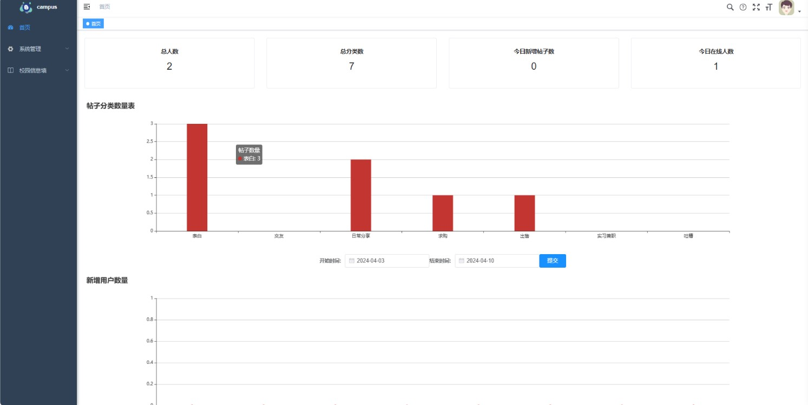
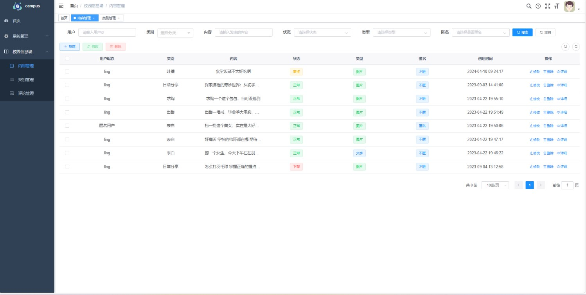
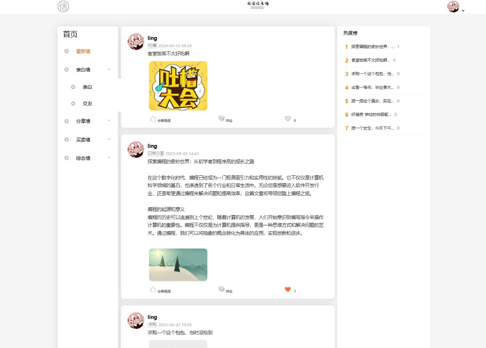
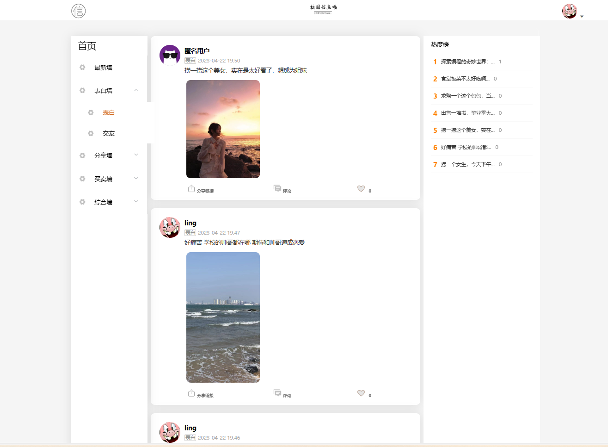
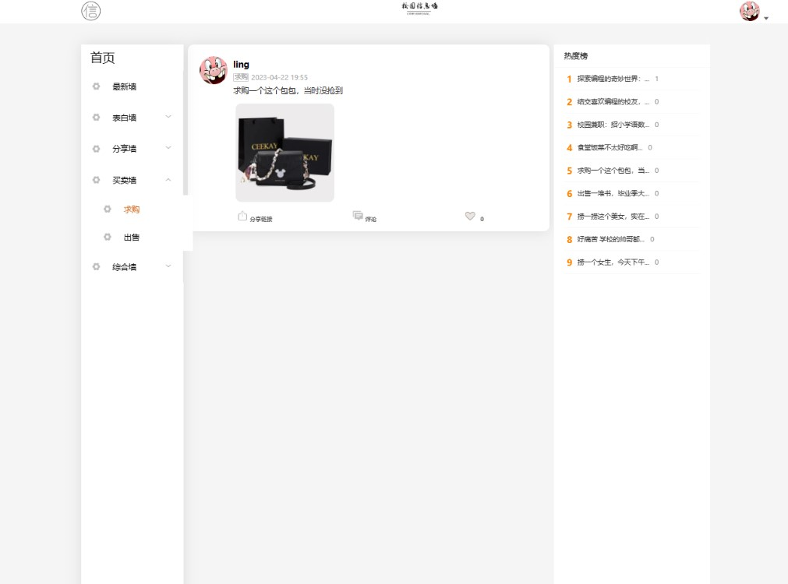
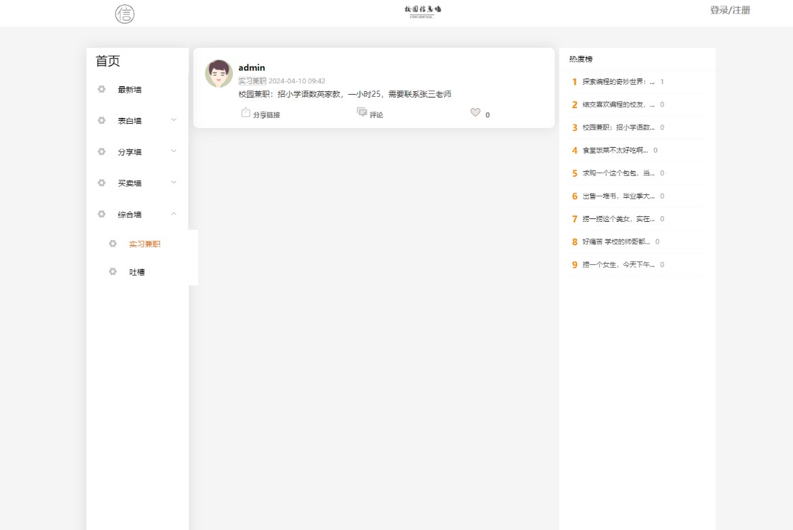
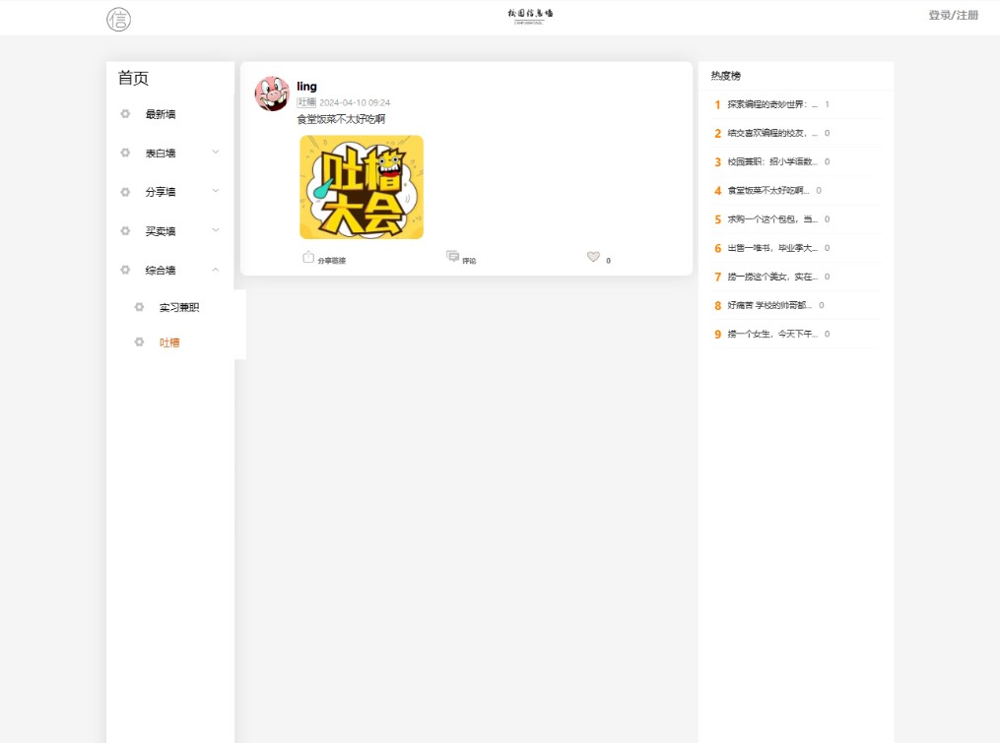
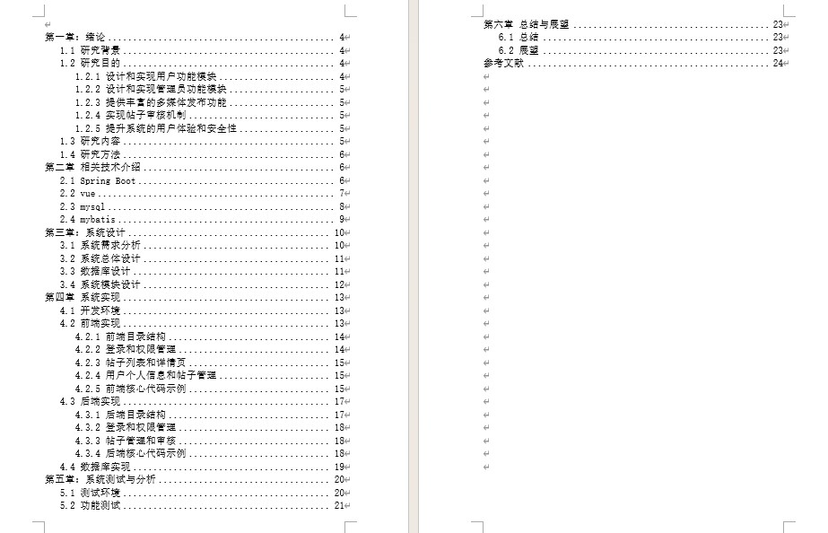
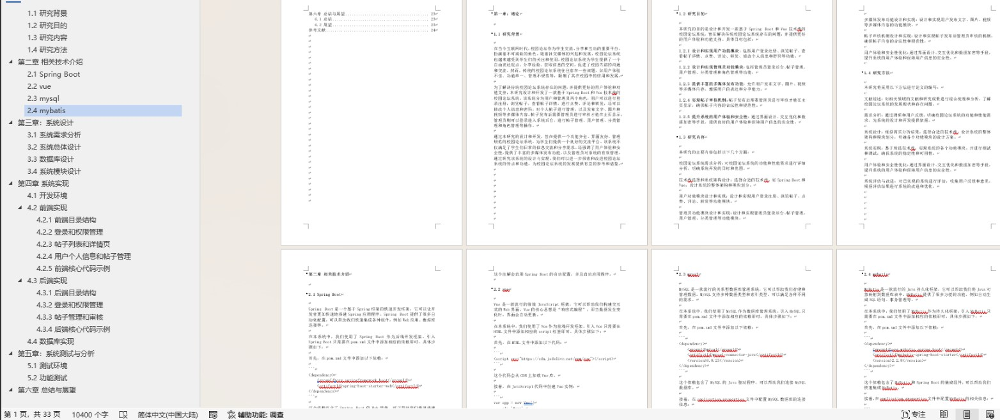

# 校园论坛系统带万字文档

### 完整项目获取

通过网盘分享的文件：校园论坛系统

链接: https://pan.baidu.com/s/1wFZmrApQ3gTxQbLO-53h1A?pwd=8aex 提取码: 8aex --来自百度网盘超级会员v3的分享

通过网盘分享的文件：工具包

链接: https://pan.baidu.com/s/1YmdoJvkjoUjA75wvHLDZ6A?pwd=xm96 提取码: xm96
--来自百度网盘超级会员v3的分享

需要远程项目部署或项目修改和毕业设计也可联系（添加申请时请备注好来意）

通过网盘分享的文件：远程调试部署联系方式

链接: https://pan.baidu.com/s/1W0dDcoZmayG0c7USJDYBYg?pwd=nqd7 提取码: nqd7
--来自百度网盘超级会员v3的分享

### 项目合集(项目不断更新中)
链接: https://pan.baidu.com/s/1nY-zhvAK0CXYcn3g7LzQnQ?pwd=id3c 提取码: id3c
--来自百度网盘超级会员v3的分享

#### 这些项目一起发你了 可以分享给你需要的同学 调试可找我 也接二次修改和项目定制、毕业设计等

## 接毕业设计和论文

微信联系方式：xzxj0206  QQ：3808981644   (支持修改、 部署调试、 支持代做毕设)

接网站建设、小程序、H5、APP、各种系统等，单片机、嵌入式也可以做

选题+开题报告+任务书+程序定制+安装调试+论文+答辩ppt  都可以做

## 一、介绍

基于springboot+vue的前后端分离校园论坛系统

有两个角色：管理员和用户

1.多功能丰富：系统内置了表白墙、分享墙、买卖墙、综合墙四个板块，用户可以根据自己的需求发布帖子，分享自己的校园生活，丰富了用户的校园经历。

2.热度排行榜：系统针对帖子的热门程度进行排行，将用户感兴趣的内容置于首页，为用户提供更优质的服务。

3.后台管理：管理员可以进入后台管理进行内容管理，类型管理，评论管理和用户管理，从而可以更好地为用户服务，保持平台内容的质量。

4.图片分享：用户可以上传和分享图片，更好地表达自己的校园生活，丰富自己的个人作品和经验分享。

## 二、软件架构

语言：java

前端技术：Vue、 ELementUI

后端技术：SpringBoot、Mybatis-Plus

数据库：MySQL

## 三、系统部分功能页面展示

## 四、附赠10000字论文参考

